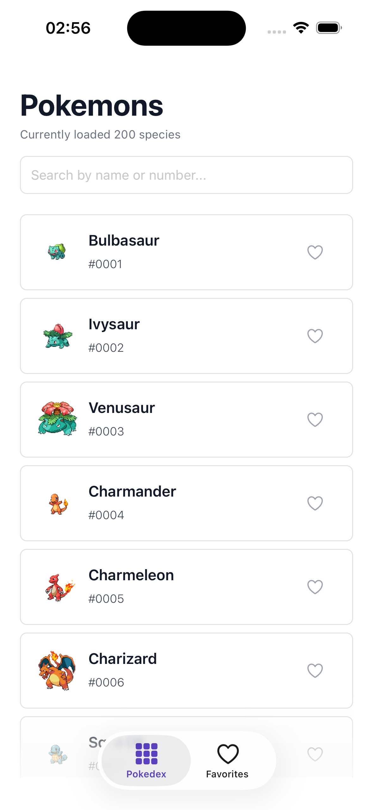
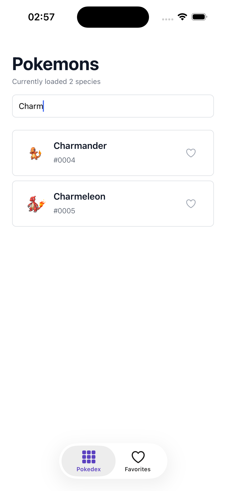
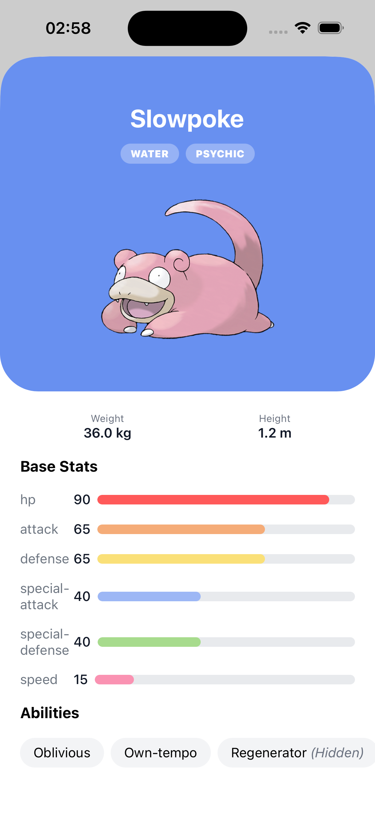
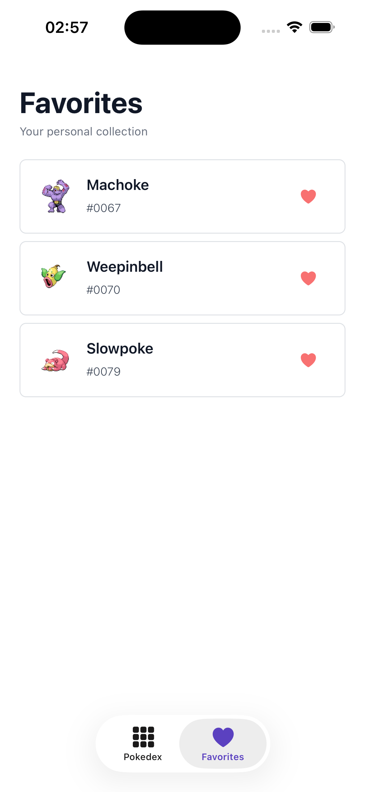

# Pokedex

A cross-platform Pokedex app built with React Native and Expo as a hands-on crash course into modern mobile development.

<!-- TODO: Add hero screenshot -->


## Screenshots

| Home | Search | Details | Favorites |
| :---: | :---: | :---: | :---: |
|  |  |  |  |

## Features

- Browse the full Pokedex with infinite scrolling powered by FlashList
- Search Pokemon by name with debounced input
- View detailed stats, abilities, and physical attributes
- Save and manage favorites with persistent storage
- Modal-based detail view with type-based dynamic theming
- Cross-platform support (iOS, Android, Web)

## Tech Stack

| Library | Purpose |
| :--- | :--- |
| [Expo](https://expo.dev) (SDK 54) | Runtime, tooling, and dev client |
| [Expo Router](https://docs.expo.dev/router/introduction/) | File-based routing and navigation |
| [TanStack Query](https://tanstack.com/query) | Server state, caching, and infinite queries |
| [Zustand](https://zustand.docs.pmnd.rs/) | Client state management |
| [react-native-mmkv](https://github.com/mrousavy/react-native-mmkv) | Persistent key-value storage (Zustand middleware) |
| [NativeWind](https://www.nativewind.dev/) | Tailwind CSS styling for React Native |
| [FlashList](https://shopify.github.io/flash-list/) | High-performance list rendering |
| [expo-image](https://docs.expo.dev/versions/latest/sdk/image/) | Optimized image loading and caching |
| [usehooks-ts](https://usehooks-ts.com/) | Utility hooks (debouncing) |
| [React Native Reanimated](https://docs.swmansion.com/react-native-reanimated/) | Animations |

## Getting Started

### Prerequisites

- Node.js 18+
- Yarn
- [Expo CLI](https://docs.expo.dev/get-started/installation/)
- iOS Simulator (macOS) or Android Emulator

### Installation

```bash
# Clone the repository
git clone <repo-url>
cd crash-course-2026

# Install dependencies
yarn install

# Prebuild native projects (required for dev client libraries like MMKV)
npx expo prebuild

# Start the dev server
yarn start
```

### Running

```bash
# iOS
yarn ios

# Android
yarn android

# Web
yarn web
```

## Architecture

For a detailed breakdown of the project structure, data layer, routing, styling, and conventions, see [architecture.md](./architecture.md).

## What I Learned

This project served as a practical deep-dive into the modern React Native ecosystem. Key takeaways:

- **Expo Router** and file-based routing with nested tab and modal navigation patterns
- **TanStack Query** for managing server state — infinite queries, caching strategies, and refetch-on-focus
- **Zustand + MMKV** as a lightweight yet performant alternative to heavier state management solutions
- **NativeWind** for bringing Tailwind's utility-first approach to React Native without sacrificing native performance
- **FlashList** as a drop-in FlatList replacement with significantly better scroll performance
- **Dev Client workflow** — working with native modules (MMKV, Nitro Modules) that require a custom dev build instead of Expo Go
- Structuring a React Native codebase with clear separation between API layer, UI components, stores, and utilities

## Data Source

All Pokemon data is fetched from [PokeAPI](https://pokeapi.co/).

## License

This project is for educational purposes.
